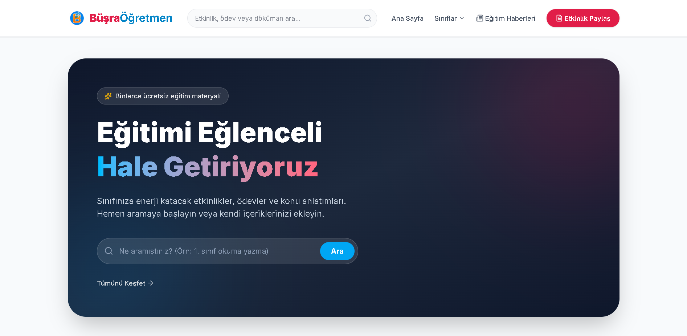
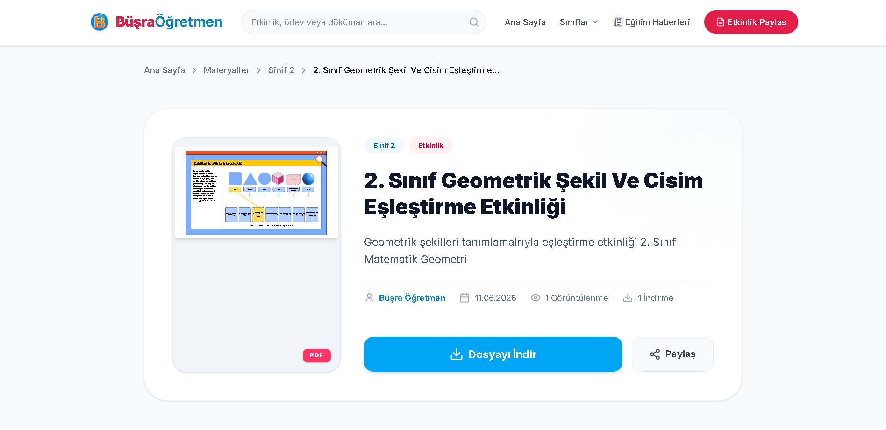
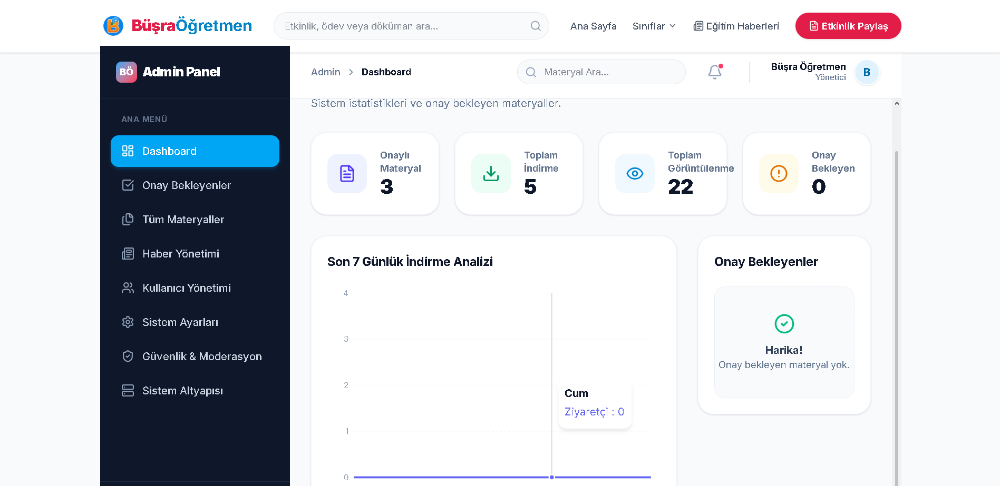
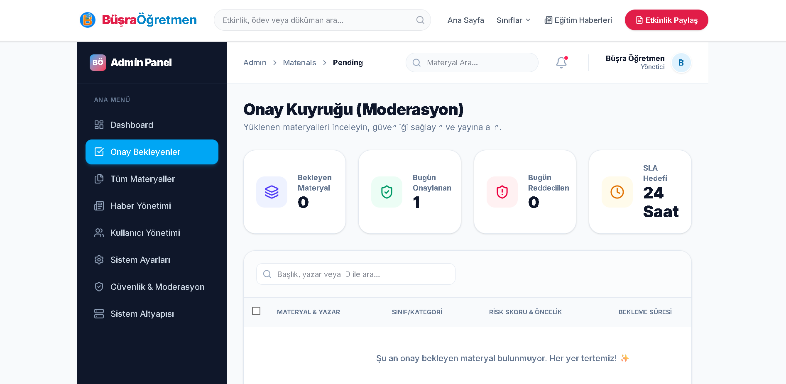

  

  <h1>Öğretmen Büşra 🎓</h1>
  
Türkiye'nin dört bir yanındaki öğretmenler, öğrenciler ve veliler için ücretsiz, güvenilir ve kaliteli eğitim materyalleri paylaşım platformu.

<a href="https://www.ogretmenbusra.com"><strong>www.ogretmenbusra.com</strong></a>
  

## 📖 Proje Hakkında

**Öğretmen Büşra**, eğitim camiasındaki kaynak dağınıklığını çözmek ve kaliteli eğitim materyallerini ücretsiz olarak herkesin erişimine sunmak amacıyla geliştirilmiş modern bir web platformudur. Gönüllü öğretmenlerin hazırladığı sınıf içi etkinlikler, ödevler, konu anlatımları ve interaktif oyunlar merkezi bir havuzda toplanarak kategorize edilir.

Platform, yüksek trafikli kullanım senaryolarına uygun olarak **Serverless mimari**, **Edge network dağıtımı** ve **sıfır-çıkış-maliyetli (zero-egress) nesne depolama** prensipleriyle inşa edilmiştir.

---

## 📸 Ekran Görüntüleri

|                      Ana Sayfa                      |                        Materyal Detay                         |
| :-------------------------------------------------: | :-----------------------------------------------------------: |
|  |  |

|                         Admin Dashboard                         |                    Editör Onay Kuyruğu                    |
| :-------------------------------------------------------------: | :-------------------------------------------------------: |
|  |  |

---

## ✨ Özellikler

- **Gelişmiş Materyal Paylaşımı ve İndirme:** Sınıf ve kategori bazlı filtreleme ile anında erişim.
- **Kapsamlı Admin & Moderasyon Paneli:** İçerik onaylama kuyruğu (Moderation Queue) ve kullanıcı yönetimi.
- **Eğitim Haberleri Modülü:** Güncel duyuruların ve eğitim haberlerinin yayınlandığı CMS yapısı.
- **Dinamik Kategori & Sınıf Sistemi:** Okul öncesinden 4. sınıfa ve genel eğitim kategorilerine kadar geniş yelpaze.
- **Edge Security & Bot Koruması:** Cloudflare Turnstile, Upstash Redis Rate Limiting ve IP hash doğrulama.
- **Güvenli Nesne Depolama:** S3 API uyumlu Cloudflare R2 entegrasyonu ve süre kısıtlamalı (Presigned URL) güvenli indirme/yükleme yapısı.
- **Responsive & Erişilebilir UI:** Shadcn UI ve Tailwind CSS ile tüm cihazlarda kusursuz deneyim.

---

## 🛠️ Teknolojiler

| Katman                   | Teknoloji                                                  | Açıklama                                                        |
| :----------------------- | :--------------------------------------------------------- | :-------------------------------------------------------------- |
| **Frontend**             | Next.js 15 (App Router), React 19, Tailwind CSS, Shadcn UI | Modern, SSR/ISR destekli ve optimize edilmiş arayüz mimarisi.   |
| **Backend**              | Next.js Server Actions, Route Handlers                     | Gelişmiş API rotaları ve form yönetimi.                         |
| **Database**             | PostgreSQL, Prisma ORM                                     | Tip güvenli ve ilişkisel veri yönetimi.                         |
| **Authentication**       | Auth.js (NextAuth v5)                                      | Middleware tabanlı, Edge uyumlu JWT oturum yönetimi.            |
| **Storage**              | Cloudflare R2                                              | S3 protokolü destekli, sıfır çıkış ücretli depolama.            |
| **Caching & Rate Limit** | Upstash Redis                                              | Edge üzerinde çalışan sliding-window rate limit ve cache.       |
| **Validation**           | Zod                                                        | Şema bazlı uçtan uca veri doğrulama.                            |
| **Email**                | Resend                                                     | Yüksek deliverability oranına sahip kurumsal e-posta altyapısı. |
| **Logging**              | Pino                                                       | Yüksek performanslı JSON bazlı loglama.                         |

---

## 🏗️ Sistem Mimarisi

Sistem, **Vercel Serverless Functions** ve **Edge Network** üzerinde çalışacak şekilde tasarlanmıştır.

1. **İstemci (Client):** Kullanıcı istekleri doğrudan Edge cache sunucuları tarafından karşılanır.
2. **Edge Proxy (Middleware):** Tüm istekler `proxy.ts` üzerinden geçer. Burada yetkilendirme, rol kontrolü ve **Upstash Redis** ile Rate Limit filtrelemesi yapılır.
3. **Core (Server Actions / API):** İstek geçerliyse iş iş mantığına (Business Logic) aktarılır. Zod ile payload doğrulanır.
4. **Veri Katmanı:** Prisma üzerinden Supabase/PostgreSQL bağlantısı kurulur (Connection Pooling aktif).
5. **Depolama Katmanı:** Dosya yükleme/indirme işlemleri, sunucu belleğini yormamak için **Presigned URL** modeli ile doğrudan tarayıcı ile Cloudflare R2 arasında gerçekleşir.

---

## 📁 Proje Klasör Yapısı

Platform, "Feature-Sliced Design" (Özellik Bazlı Bölümleme) prensiplerine yakın, ölçeklenebilir bir modüler yapı kullanır.

ogretmen-busra/
├── prisma/ # Veritabanı şeması ve seed dosyaları
├── public/ # Statik varlıklar ve worker scriptleri
├── src/
│ ├── app/ # Next.js App Router sayfaları ve API uç noktaları
│ │ ├── (public)/ # Açık erişimli sayfalar (Ana sayfa, materyaller, iletişim)
│ │ ├── admin/ # Korumalı yönetim paneli
│ │ └── api/ # Route Handlers (Webhook, upload, download vb.)
│ ├── infrastructure/ # Dış servis bağlantıları (DB, R2, Logger, Monitoring)
│ ├── modules/ # Domain bazlı izole modüller (materials, auth, news vb.)
│ └── shared/ # Ortak bileşenler, hook'lar, layout ve tipler
├── .env.example # Örnek çevresel değişkenler
└── next.config.ts # Next.js derleme ve security header ayarları

---

## 🚀 Kurulum Adımları

Projeyi lokal ortamınızda çalıştırmak için aşağıdaki adımları izleyin.

1. Gereksinimler
   Node.js 18+ (Node 20+ önerilir)

PostgreSQL (Lokal veya Supabase üzerinden)

Upstash Redis Hesabı

Cloudflare R2 Hesabı

2. Repoyu Klonlayın

git clone [https://github.com/ozaycank/ogretmen-busra.git](https://github.com/ozaycank/ogretmen-busra.git)

cd ogretmen-busra

3. Bağımlılıkları Yükleyin

npm install

# veya yarn install / pnpm install

---

## 🗄️ Veritabanı Tasarımı Özeti

Ana varlıklar (Entities):

User: Admin ve moderatör kimlik bilgileri.

Material: Platformun çekirdek verisi (İsim, boyut, R2 key, kategori, sınıf bilgisi, statü).

News: SEO uyumlu eğitim haberleri / duyuruları.

AuditLog: Güvenlik gereği yapılan kritik işlemlerin iz kayıtları.

SiteStats / SystemSetting: Analitik sayaçları ve dinamik konfigürasyonlar.

---

## 🗺️ Roadmap

[x] Temel CMS ve Onay Kuyruğu Sistemi.

[x] Cloudflare R2 Presigned Upload & Download Entegrasyonu.

[x] CF Email Routing ve Resend Kurumsal Mail Yapılandırması.

[ ] Gelişmiş QStash arka plan görevleri (Orphaned file cleanup, otomatik virüs tarama).

[ ] Kullanıcılar arası materyal oylama ve yorum sistemi.

[ ] Materyaller için yapay zeka destekli etiketleme (Auto-tagging).

---

## 🤝 Katkıda Bulunma

Bu projenin misyonu, eğitime katkı sağlamaktır. PR (Pull Request) gönderimleri memnuniyetle karşılanır.

Projeyi Fork'layın.

Yeni bir dal oluşturun (git checkout -b feature/EgitimGelistirmesi).

Değişikliklerinizi commit edin (git commit -m 'feat: Yeni filtreleme eklendi').

Dalınıza pushlayın (git push origin feature/EgitimGelistirmesi).

Pull Request oluşturun.

---

## 📄 Lisans

Bu proje MIT Lisansı altında lisanslanmıştır. Daha fazla bilgi için LICENSE dosyasına bakabilirsiniz.

---

## 📬 İletişim

Öğretmen Büşra Ekibi
Email: iletisim@ogretmenbusra.com
Website: ogretmenbusra.com

---

## 🙏 Teşekkür

Bu platformun var olmasını sağlayan ve materyallerini karşılıksız paylaşan tüm öğretmenlerimize, açık kaynak ekosistemine ve projede kullanılan modern araçların yaratıcılarına (Vercel, Cloudflare, Prisma, vb.) sonsuz teşekkürler.
